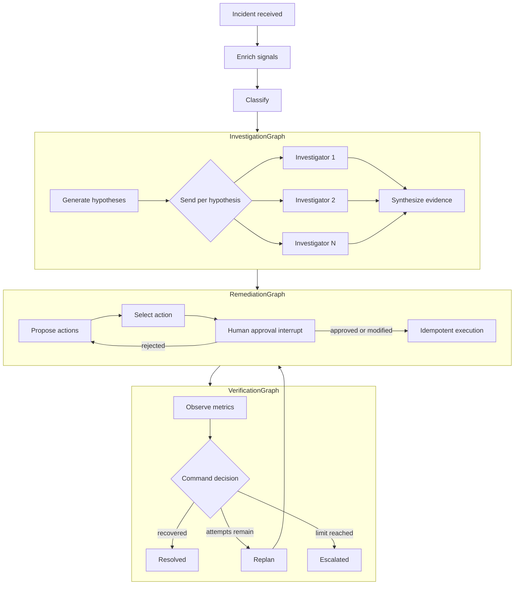

# StateOps

[Português brasileiro](README.pt-br.md)

**Durable, replayable incident-response state machine built with LangGraph and the
Governed LLM Gateway.**

StateOps is not a chatbot. It is a durable state machine for long-running agentic workflows.
Every incident is a thread, every transition changes explicit state, and every super-step can be
checkpointed. Executions can pause, survive process restart, resume, replay, and fork.

The LLM may reason while the graph controls execution.

## Why this is a graph rather than a pipeline

The workflow cannot be reduced to a fixed sequence of LLM calls. Investigation expands dynamically
from the hypotheses produced at runtime, independent branches converge through reducers, a human
decision suspends execution without losing state, and verification may terminate, replan, or
escalate. Checkpoints are executable control-flow positions: they support recovery, replay, and new
branches without rewriting prior history.

This makes state transitions, concurrency, interruption, and side-effect semantics part of the
application design instead of incidental framework behavior.

## What this repository demonstrates

- an explicit `IncidentState`, not a conversation hidden inside `MessagesState`;
- custom deterministic reducers for parallel writes;
- variable-width map/reduce investigation with LangGraph `Send`;
- typed `Command` nodes that update state and route in one operation;
- three per-invocation subgraphs with inherited checkpointing;
- human approval through `interrupt()` and `Command(resume=...)`;
- Redis checkpoints keyed by `thread_id = incident_id`;
- `get_state`, `get_state_history`, replay, and controlled `update_state` forks;
- an atomic Redis `SET NX` boundary for idempotent simulated remediations;
- v3 state streaming, structured logs, and opt-in metadata-only OpenTelemetry;
- a production LLM adapter that knows only the provider-neutral Governed LLM Gateway client.

## Engineering evidence map

| Concept | Implementation evidence |
| --- | --- |
| Explicit typed state and reducer channels | [`IncidentState`](src/stateops/graphs/state.py) |
| Valid lifecycle transitions | [`domain/transitions.py`](src/stateops/domain/transitions.py) |
| Deterministic parallel aggregation | [`domain/reducers.py`](src/stateops/domain/reducers.py) |
| Dynamic fan-out and map/reduce with `Send` | [`InvestigationGraph`](src/stateops/graphs/investigation/graph.py) |
| Human interrupt and idempotent execution | [`RemediationGraph`](src/stateops/graphs/remediation/graph.py) |
| Typed update-and-route decisions with `Command` | [`VerificationGraph`](src/stateops/graphs/verification/graph.py) |
| History, replay, controlled fork, and nested state reads | [`GraphIncidentRuntime`](src/stateops/graphs/runtime.py) |
| Durable checkpoints and restricted deserialization | [`Redis checkpointer`](src/stateops/adapters/persistence/checkpointer.py) |
| Atomic effect deduplication | [`Redis remediation ledger`](src/stateops/adapters/remediation/redis_executor.py) |
| Real restart/resume proof | [`Redis integration test`](tests/integration/test_redis_runtime.py) |

## Workflow



## Architecture boundary

```text
StateOps workflow and business-tool authorization
        │ workload + requirements + Gateway credential
        ▼
Governed LLM Gateway Client
        ▼
Governed LLM Gateway (policy, model/provider selection, retry/fallback, provenance)
        ▼
authorized provider/model
```

StateOps never imports a provider SDK and never accepts provider API keys. The Gateway does not
execute StateOps remediation tools. The client is pinned to inspected commit
`3f482dfa67484686ccc55796591713345abb93c1`.

Local tests and demos default to `STATEOPS_REASONER=deterministic`, which makes no LLM call. A
production-style run must set `STATEOPS_REASONER=gateway` and provide only:

```dotenv
GOVERNED_LLM_GATEWAY_URL=https://gateway.example.test
GOVERNED_LLM_GATEWAY_API_KEY=...
STATEOPS_LLM_WORKLOAD=stateops.incident.reasoning
```

The external Gateway/Policy Model Router must authorize that dotted workload. StateOps does not
assume that it is authorized and does not fall back to a direct provider when it is denied.

## Quick start

Prerequisites: Python 3.13, `uv`, Docker, and Docker Compose.

```bash
uv sync --frozen --all-groups --extra observability
docker compose up --build
```

Create an incident:

```bash
curl --request POST http://127.0.0.1:8000/incidents \
  --header 'Content-Type: application/json' \
  --data '{
    "incident_id": "INC-2026-00817",
    "service": "checkout-service",
    "error_rate_before": 0.2,
    "error_rate_after": 18.0,
    "deployment": "v2.31",
    "started_at": "2026-09-14T12:00:00Z"
  }'
```

The response is `202 Accepted`, has `interrupted: true`, and exposes the selected action in the
interrupt payload. Approve it with the same incident/thread ID:

```bash
curl --request POST http://127.0.0.1:8000/incidents/INC-2026-00817/approval \
  --header 'Content-Type: application/json' \
  --data '{
    "decision": "approved",
    "action_id": "rollback-primary",
    "comment": "Proceed with the known-good release"
  }'
```

The deterministic scenario ends in `resolved`. A `modified` decision may change only parameters
already declared by the selected action; arbitrary commands and new parameter names fail closed.

## Persistence and crash/resume

`AsyncRedisSaver` persists checkpoints and a separate Redis key namespace enforces one simulated
effect for each `incident_id:action_id:action_revision` key with atomic `SET NX`. `InMemorySaver` is
used only in unit tests. Redis 8 supplies the Redis JSON and Redis Search capabilities required by
the checkpointer; Compose enables append-only persistence and configures no checkpoint TTL.

To prove recovery:

1. Create an incident and wait for `waiting_approval`.
2. Stop only the service: `docker compose stop stateops`.
3. Start it again: `docker compose start stateops`.
4. Read `GET /incidents/INC-2026-00817`; it remains `waiting_approval`.
5. Submit the approval. Execution resumes from Redis and finishes.

The node containing `interrupt()` performs no side effect before the interrupt. The effect runs in a
dedicated node and the atomic Redis claim makes re-execution safe.

## Guarantees and deliberate limits

- Graph nodes may be executed more than once after resume or replay; simulated effects are protected
  by an idempotency key and an atomic Redis claim.
- Checkpoints have no TTL so history, replay, and fork remain available; production operators must
  define retention and memory limits explicitly.
- Compose enables Redis AOF for the local durability demonstration, but this repository does not
  claim a production RTO, RPO, backup policy, or high-availability topology.
- Remediations and operational signals are synthetic. Replacing them with production tools requires
  a separately reviewed authorization and idempotency design.
- LangGraph v3 event streaming is intentionally demonstrated and currently emits an experimental API
  warning from the framework.

## History, replay, fork, and streaming

```text
GET  /incidents/{incident_id}/history
POST /incidents/{incident_id}/replay/{checkpoint_id}
POST /incidents/{incident_id}/fork
POST /incidents/{incident_id}/events
```

Replay re-executes nodes after a checkpoint; it does not read a cached answer. Fork creates a new
checkpoint branch with a controlled `selected_action_id`; it is not rollback and it does not erase
the original history. The events endpoint drives LangGraph `astream_events(..., version="v3")` and
projects only state snapshots as server-sent events.

See [API](docs/API.md), [demo runbook](docs/DEMO.md), and the
[checkpoint-boundary ADR](docs/adr/0002-langgraph-checkpoint-boundaries.md).

## Developer workflow

The repository was bootstrapped from `codex-python-engineering-harness` commit
`e9e297456573d216f070a41a7cdaa108dd599c5b` with the `service` and `agentic` governance profiles.

```bash
uv lock --check
uv sync --frozen --all-groups --extra observability
uv run ruff check .
uv run ruff format --check .
uv run mypy src tests
uv run pytest
uv run python scripts/quality_gate.py
```

Print the expanded graph as Mermaid with `uv run stateops graph`. See `AGENTS.md` for the complete
repository contract.

## Safety and scope

All incident signals and remediation effects are synthetic. StateOps does not access Kubernetes,
cloud accounts, databases other than its local persistence store, or production observability
systems. Checkpoint and telemetry evidence is metadata-only by default; prompts, completions,
credentials, and raw operational payloads must not be logged.

## Documentation

- [Architecture](docs/ARCHITECTURE.md)
- [HTTP API](docs/API.md)
- [Five-minute and crash/resume demo](docs/DEMO.md)
- [Security and privacy](docs/SECURITY.md)
- [ADR-0002: checkpoint and subgraph boundaries](docs/adr/0002-langgraph-checkpoint-boundaries.md)
- [ADR-0003: idempotent remediation effects](docs/adr/0003-idempotent-remediation-effects.md)
- [ADR-0004: Governed LLM Gateway boundary](docs/adr/0004-governed-llm-gateway-boundary.md)
- [ADR-0005: Redis persistence](docs/adr/0005-redis-persistence.md)

## Related projects

- [Governed LLM Gateway](https://github.com/brunovicco/governed-llm-gateway): provider-neutral policy,
  routing, and execution boundary for StateOps LLM workloads.
- [Codex Python Engineering Harness](https://github.com/brunovicco/codex-python-engineering-harness):
  engineering, architecture, quality, and governance baseline used to bootstrap this repository.
