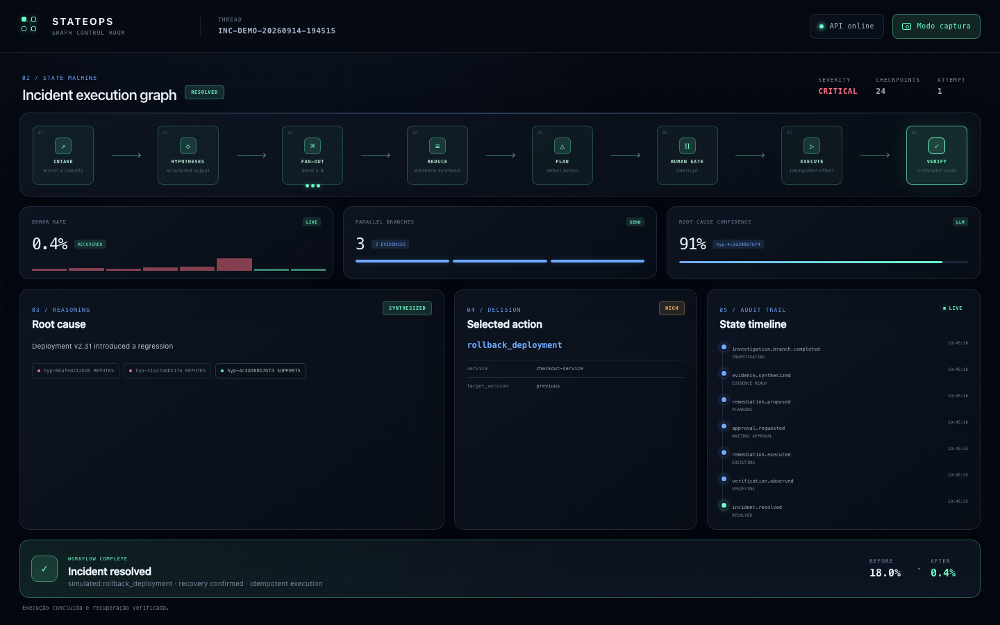
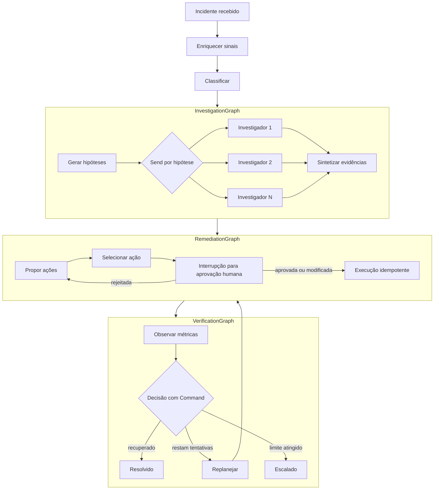

# StateOps

[English](README.md)

**Máquina de estados durável e reproduzível para resposta a incidentes, construída com LangGraph e
Governed LLM Gateway.**

O StateOps não é um chatbot, e sim uma máquina de estados durável para workflows agênticos de longa
duração. Cada incidente é uma thread, cada transição altera um estado explícito e cada ciclo de execução
(super-step) pode gerar um checkpoint. As execuções podem ser pausadas, sobreviver à reinicialização do
processo, ser retomadas, reproduzidas e bifurcadas.

O LLM pode raciocinar enquanto o grafo controla a execução.



## Por que isto é um grafo, e não uma pipeline

O workflow não pode ser reduzido a uma sequência fixa de chamadas a LLMs. A investigação se expande
dinamicamente a partir das hipóteses produzidas em tempo de execução, ramos independentes convergem
por meio de reducers, uma decisão humana suspende a execução sem perder o estado e a verificação pode
finalizar, replanejar ou escalar. Checkpoints são posições executáveis no fluxo de controle: eles
permitem recuperação, replay e novas ramificações sem reescrever o histórico anterior.

Assim, transições de estado, concorrência, interrupções e semântica de efeitos colaterais fazem parte
do design da aplicação, em vez de serem comportamentos incidentais do framework.

## O que este repositório demonstra

- um `IncidentState` explícito, e não uma conversa oculta dentro de `MessagesState`;
- reducers determinísticos personalizados para escritas paralelas;
- investigação map/reduce com largura variável usando `Send` do LangGraph;
- nós `Command` tipados que atualizam o estado e definem a rota em uma única operação;
- três subgrafos por invocação com checkpoint herdado;
- aprovação humana por meio de `interrupt()` e `Command(resume=...)`;
- checkpoints Redis com `thread_id = incident_id`;
- `get_state`, `get_state_history`, replay e forks controlados com `update_state`;
- uma barreira Redis atômica com `SET NX` para remediações simuladas idempotentes;
- streaming de estado v3, logs estruturados e OpenTelemetry opcional somente com metadados;
- schemas de saída estruturada portáveis entre providers, com limites de coleção aplicados pela
  aplicação;
- falhas terminais de raciocínio modeladas como valores `WorkflowError` serializáveis e estado
  `FAILED`;
- um adapter de LLM para produção que conhece apenas o cliente provider-neutral do Governed LLM
  Gateway.

## Mapa de evidências de engenharia

| Conceito | Evidência na implementação |
| --- | --- |
| Estado explícito tipado e canais com reducers | [`IncidentState`](src/stateops/graphs/state.py) |
| Transições válidas do ciclo de vida | [`domain/transitions.py`](src/stateops/domain/transitions.py) |
| Agregação paralela determinística | [`domain/reducers.py`](src/stateops/domain/reducers.py) |
| Fan-out dinâmico e map/reduce com `Send` | [`InvestigationGraph`](src/stateops/graphs/investigation/graph.py) |
| Interrupção humana e execução idempotente | [`RemediationGraph`](src/stateops/graphs/remediation/graph.py) |
| Decisões tipadas de atualização e rota com `Command` | [`VerificationGraph`](src/stateops/graphs/verification/graph.py) |
| Histórico, replay, fork controlado e leitura de estado aninhado | [`GraphIncidentRuntime`](src/stateops/graphs/runtime.py) |
| Checkpoints duráveis e desserialização restrita | [`Checkpointer Redis`](src/stateops/adapters/persistence/checkpointer.py) |
| Estado de falha de raciocínio seguro para metadados | [`graphs/failures.py`](src/stateops/graphs/failures.py) |
| Deduplicação atômica de efeitos | [`Ledger de remediação Redis`](src/stateops/adapters/remediation/redis_executor.py) |
| Prova real de reinicialização e retomada | [`Teste de integração Redis`](tests/integration/test_redis_runtime.py) |

## Workflow



## Limite arquitetural

```text
Workflow do StateOps e autorização das ferramentas de negócio
        │ workload + requisitos + credencial do Gateway
        ▼
Cliente do Governed LLM Gateway
        ▼
Governed LLM Gateway (política, seleção de modelo/provider, retry/fallback, proveniência)
        ▼
provider/modelo autorizado
```

O StateOps nunca importa o SDK de um provider e nunca aceita chaves de API de providers.
O Gateway não executa as ações corretivas do StateOps. O cliente está fixado no commit inspecionado
`3f482dfa67484686ccc55796591713345abb93c1`.

Testes e demonstrações locais usam `STATEOPS_REASONER=deterministic` por padrão, sem realizar chamadas
a LLMs. Uma execução no estilo de produção deve definir `STATEOPS_REASONER=gateway` e fornecer apenas:

```dotenv
GOVERNED_LLM_GATEWAY_URL=https://gateway.example.test
GOVERNED_LLM_GATEWAY_API_KEY=...
STATEOPS_LLM_WORKLOAD=stateops.incident.reasoning
```

O Gateway/Policy Model Router externo deve autorizar esse workload em formato pontuado. O StateOps não
presume que ele esteja autorizado e não recorre diretamente a um provider quando a solicitação é
negada.
Falhas terminais do Gateway são reduzidas a metadados estáveis de erro e à fase `FAILED`; exceções
brutas do cliente ou do provider nunca são adicionadas ao estado persistido em checkpoint.

## Início rápido

Pré-requisitos: Python 3.13, `uv`, Docker e Docker Compose.

```bash
uv sync --frozen --all-groups --extra observability
docker compose up --build
```

Abra [http://127.0.0.1:8000/ui](http://127.0.0.1:8000/ui) para usar o **StateOps Control
Room**. O frontend é servido pelo próprio processo FastAPI, não usa CDN nem framework JavaScript e
acompanha o stream de estados do LangGraph. Ele permite iniciar ou carregar uma thread, observar o
fan-out das investigações, aprovar ou rejeitar a ação selecionada e conferir a recuperação. O botão
**Modo captura** remove os controles de entrada e expande o painel para screenshots.

Para operar a mesma demonstração pela API, crie um incidente:

```bash
curl --request POST http://127.0.0.1:8000/incidents \
  --header 'Content-Type: application/json' \
  --data '{
    "incident_id": "INC-2026-00817",
    "service": "checkout-service",
    "error_rate_before": 0.2,
    "error_rate_after": 18.0,
    "deployment": "v2.31",
    "started_at": "2026-09-14T12:00:00Z"
  }'
```

A resposta é `202 Accepted`, contém `interrupted: true` e expõe a ação selecionada no payload da
interrupção. Aprove-a usando o mesmo ID de incidente/thread:

```bash
curl --request POST http://127.0.0.1:8000/incidents/INC-2026-00817/approval \
  --header 'Content-Type: application/json' \
  --data '{
    "decision": "approved",
    "action_id": "rollback-primary",
    "comment": "Prosseguir com a versão estável conhecida"
  }'
```

O cenário determinístico termina em `resolved`. Uma decisão `modified` pode alterar somente
parâmetros já declarados pela ação selecionada; comandos arbitrários e novos nomes de parâmetros são
rejeitados de forma segura.

## Persistência e recuperação após falha

O `AsyncRedisSaver` persiste checkpoints, enquanto um namespace Redis separado garante um único
efeito simulado para cada chave `incident_id:action_id:action_revision` por meio do `SET NX` atômico.
O `InMemorySaver` é usado apenas nos testes unitários. O Redis 8 fornece Redis JSON e Redis Search,
recursos exigidos pelo checkpointer; o Compose habilita persistência append-only e não configura TTL
para os checkpoints.

Para comprovar a recuperação:

1. Crie um incidente e aguarde o estado `waiting_approval`.
2. Pare somente o serviço: `docker compose stop stateops`.
3. Inicie-o novamente: `docker compose start stateops`.
4. Consulte `GET /incidents/INC-2026-00817`; o estado continuará como `waiting_approval`.
5. Envie a aprovação. A execução será retomada do Redis e finalizada.

O nó que contém `interrupt()` não produz efeitos colaterais antes da interrupção. O efeito é executado
em um nó dedicado, e a reivindicação atômica no Redis torna a reexecução segura.

## Garantias e limites intencionais

- Nós do grafo podem ser executados mais de uma vez após uma retomada ou replay; os efeitos simulados
  são protegidos por uma chave de idempotência e uma reivindicação Redis atômica.
- Os checkpoints não possuem TTL para manter histórico, replay e fork disponíveis; operadores de
  produção devem definir retenção e limites de memória explicitamente.
- O Compose habilita AOF no Redis para a demonstração local de durabilidade, mas este repositório não
  declara RTO, RPO, política de backup ou topologia de alta disponibilidade para produção.
- Remediações e sinais operacionais são sintéticos. Substituí-los por ferramentas de produção exige
  um design de autorização e idempotência revisado separadamente.
- O streaming de eventos v3 do LangGraph é demonstrado intencionalmente e atualmente emite um aviso
  de API experimental do framework.

## Histórico, replay, fork e streaming

```text
GET  /ui
GET  /incidents/{incident_id}/history
POST /incidents/{incident_id}/replay/{checkpoint_id}
POST /incidents/{incident_id}/fork
POST /incidents/{incident_id}/events
```

O replay reexecuta os nós posteriores a um checkpoint; ele não lê uma resposta em cache. O fork cria
uma nova ramificação de checkpoints com um `selected_action_id` controlado; ele não é um rollback e
não apaga o histórico original. O endpoint de eventos executa
`astream_events(..., version="v3")` do LangGraph e projeta somente snapshots de estado como eventos
enviados pelo servidor.

Consulte a [API](docs/API.md), o [runbook da demonstração](docs/DEMO.md) e o
[ADR dos limites de checkpoint](docs/adr/0002-langgraph-checkpoint-boundaries.md).

## Fluxo de desenvolvimento

O repositório foi inicializado a partir do commit
`e9e297456573d216f070a41a7cdaa108dd599c5b` do `codex-python-engineering-harness`, usando os perfis
`service` e `agentic` de governança.

```bash
uv lock --check
uv sync --frozen --all-groups --extra observability
uv run ruff check .
uv run ruff format --check .
uv run mypy src tests
uv run pytest
uv run python scripts/quality_gate.py
```

Exiba o grafo expandido em Mermaid com `uv run stateops graph`. Consulte `AGENTS.md` para conhecer o
contrato completo do repositório.

## Segurança e escopo

Todos os sinais de incidentes e efeitos de remediação são sintéticos. O StateOps não acessa
Kubernetes, contas de cloud, bancos de dados além de seu armazenamento local de persistência ou
sistemas de observabilidade de produção. Evidências de checkpoints e telemetria contêm somente
metadados por padrão; prompts, respostas, credenciais e payloads operacionais brutos não devem ser
registrados em logs.

## Documentação

- [Arquitetura](docs/ARCHITECTURE.md)
- [API HTTP](docs/API.md)
- [Demonstração de cinco minutos e recuperação após falha](docs/DEMO.md)
- [Segurança e privacidade](docs/SECURITY.md)
- [ADR-0002: limites de checkpoints e subgrafos](docs/adr/0002-langgraph-checkpoint-boundaries.md)
- [ADR-0003: efeitos de remediação idempotentes](docs/adr/0003-idempotent-remediation-effects.md)
- [ADR-0004: limite do Governed LLM Gateway](docs/adr/0004-governed-llm-gateway-boundary.md)
- [ADR-0005: persistência com Redis](docs/adr/0005-redis-persistence.md)

## Projetos relacionados

- [Governed LLM Gateway](https://github.com/brunovicco/governed-llm-gateway): limite provider-neutral
  de políticas, roteamento e execução para os workloads de LLM do StateOps.
- [Codex Python Engineering Harness](https://github.com/brunovicco/codex-python-engineering-harness):
  baseline de engenharia, arquitetura, qualidade e governança usado para inicializar este repositório.

## Licença

MIT. Consulte [LICENSE](LICENSE).
